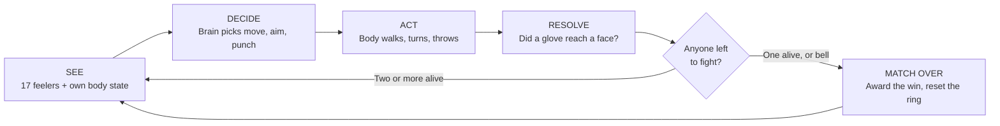
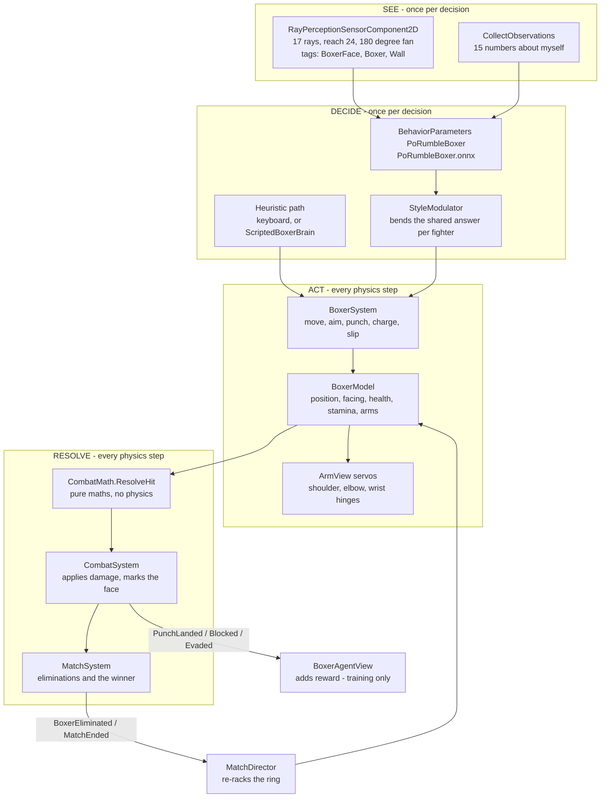
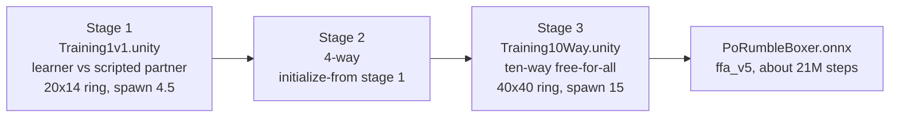

# Core Architecture & Game Loop

**PoRumble** — top-down 2D boxing battle royale. Ten fighters, last one standing, with
ML-trained opponents. Captured 2026-09-12 against the project as it stands on `main`.

Every number here was read out of the project files, not remembered. Where a serialized
asset disagrees with a code default or with an older doc, the serialized value is quoted
and the disagreement is flagged in [Known gaps](#known-gaps-flagged-2026-09-12).

---

## Tier 1 — Quick Look (30 seconds)

Ten boxers start in a circle facing the middle of a square ring. Each one looks around with
a fan of 17 feelers, decides ten times a second whether to walk, turn, or throw a fist, and
loses health when somebody else's glove reaches its face. The last fighter standing wins.

Nine of the ten are driven by a trained AI brain — a single 475 KB file that every AI boxer
shares. They all use the same brain; what makes BIGGIE fight differently from EPSTEIN is a
thin **style layer** that bends the brain's answer on its way to the body, plus per-fighter
attributes for power, chin, speed and recovery. One roster seat is reserved for a
hand-written "scripted" opponent that never surprises you, and it is always **red**.

Nothing about the fight is faked. Punches are resolved by a small piece of maths every tick,
the same way for the human player, the scripted bot and the AI — so anything the player can
do, the AI can do, and the other way round.

**Where the AI came from:** it was trained in a separate, stripped-down copy of the ring, one
match after another for about 21 million steps, being paid points for landing punches and
docked points for taking them. The finished brain was exported once and now just plays back.

---

## Tier 2 — Core Mechanics

### The Decision Loop (high level)



Ten times a second, every living fighter runs that circuit. The physics underneath runs five
times faster than the decisions — the body keeps carrying out the last instruction while the
brain thinks about the next one, which is what makes a punch look like a swing rather than a
teleport.

### The Decision Loop (component level)



The single most important structural fact: **`BoxerAgentView` is the only control path**. A
trained policy drives it through `OnActionReceived`; a human or the scripted brain drives the
exact same code through `Heuristic`. There is no second, easier route into the ring for the
AI, and no cheat route for the bots.

The second: **hit detection is arithmetic, not physics.** `CombatMath.ResolveHit` is a static
function over positions. That keeps the fight identical on every machine and lets the whole
combat model be unit-tested with no scene loaded — 179 EditMode tests do exactly that.

### Controls & Movement Map

**What the fighter senses** — two sources, doing different jobs:

| Channel | What it carries | Why it exists |
|---|---|---|
| 17 ray feelers | Distance and type of the first thing each ray hits: an attackable face, a body, or a wall | The number of opponents shrinks from nine to zero during a match. A fixed list of "opponent 1..9" cannot express that; rays can |
| Health | How much of my 30 HP is left | |
| Facing | Which way I am pointed | |
| Move input | What I asked for last tick | Intent and travel come apart while accelerating |
| Left/right arm extension | How far each fist is out | |
| Left/right arm ready | Whether each arm can throw at all | |
| Survivors | Fraction of the roster still alive | Late-match behaviour differs from early |
| Stamina | Breath left | |
| Position in ring | How far to each wall, as a fraction | The rays give a distance in a direction; they never say "you are in a corner", which is the single most important positional fact in boxing |
| Velocity | Where I am actually sliding | So the policy knows it is still drifting into a punch it meant to step away from |

That is **15 numbers**, and the count is load-bearing: it must equal `VectorObservationSize`
on the prefab or the compiled brain refuses to load. Both the rays and the 15 numbers are
**stacked 2 deep**, so the brain always sees this moment and the one before it — that is how
it perceives movement.

**What the fighter controls:**

| Control | Type | Range | Drives |
|---|---|---|---|
| Move X | Continuous | −1 … 1 | Walk direction, left/right |
| Move Y | Continuous | −1 … 1 | Walk direction, forward/back |
| Aim X | Continuous | −1 … 1 | Where the body turns to face |
| Aim Y | Continuous | −1 … 1 | " |
| Punch left | Discrete, 2 options | throw / don't | Left fist |
| Punch right | Discrete, 2 options | throw / don't | Right fist |

> **This list is frozen.** Four continuous plus two two-way switches is exactly what
> `PoRumbleBoxer.onnx` was compiled against. Add a seventh control and the file stops loading
> altogether — not with a warning, it simply will not load. This is why the two showiest
> mechanics are **not** AI controls:
>
> - **Haymaker** (hold to wind up, release to swing) rides a side channel, `BoxerSystem.SetCharge`
> - **Slip** (a sideways burst that cannot be hit) rides another, `BoxerSystem.Dodge`
>
> The human, the scripted bots and the style layer all call those directly. The trained brain
> never uses them. The **counter** mechanic needs no control at all — blocking a punch arms it
> automatically, and the next landed punch spends it.

Movement is deliberately **not** the same in every direction. Sidesteps run at 75% of the
forward shuffle, retreats at 60%, and turning drops to 40% while a punch is already
travelling. Feed the raw input straight through and a boxer sprints backwards as fast as it
advances while pivoting mid-swing to track someone who already stepped off — which looks
nothing like boxing.

### Goals & Scoring Rules

These are the numbers the training run pays out. They are read from `Boxer.prefab`, which is
what the training scenes actually load.

**Adds points:**

| Event | Points | Note |
|---|---|---|
| Landing a punch | **+0.2 per damage point** | The core objective. A close-range punch does 2, a long one 1, a counter adds 2, a full haymaker triples it |
| Knocking someone out | **+1.0** | |
| Winning the match | **+2.0** | To the last one standing, or the healthiest at the bell |
| Slipping a punch | **+0.03** | Defence counts |
| Blocking a punch | **+0.015** | Counts for less than slipping — the punch still arrived, it just did not get through |
| Facing the nearest opponent | up to **+0.6** spread over the match | The training wheel. Without it the fighter has to stumble onto move + aim + punch all at once |
| Closing the distance | up to **+0.25** spread over the match | Stops paying once inside punching range, on purpose |
| Holding punching range | up to **+0.4** spread over the match | Peaks exactly where a fully extended fist reaches a head |

**Subtracts points:**

| Event | Points | Note |
|---|---|---|
| Taking a punch | **−0.02 per damage point** | Ten times cheaper than landing one is worth — a fighter that only defends scores nothing |
| Being knocked out | **−0.75** | |
| Throwing a punch | **−0.002** | Flailing is not free |
| Simply existing | **−1.0 spread evenly over the match** | The ring does not shrink, so standing around has to cost something or fighters learn to run away and stall the clock |

**The one trap in this table:** the closing reward stops paying once you are already in range.
It was not always so, and an earlier run learned that the cheapest way to farm it was for
every boxer to huddle against a wall together. A rising score with a *falling* spread is the
signature of that kind of exploit, not of skill.

### Engine mapping — Unity ↔ Unreal

This project is Unity. The right-hand column is what the same idea is called if the design is
rebuilt on Unreal with Learning Agents.

| Concept here | Unity (what this project uses) | Unreal equivalent |
|---|---|---|
| A fighter | `Boxer.prefab` — GameObject with child parts | Blueprint Actor with child components |
| The brain holder | `BehaviorParameters` MonoBehaviour | `ULearningAgentsPolicy` on a manager |
| The trained file | `PoRumbleBoxer.onnx` | `ULearningAgentsNeuralNetwork` data asset |
| "Think now" ticker | `DecisionRequester`, period 5 | Manager tick interval / inference cadence |
| Looking around | `RayPerceptionSensorComponent2D` | Observations built from line traces |
| What I know about myself | `CollectObservations` on the Agent | `ULearningAgentsObservations` entries |
| What I can do | Action spec: 4 continuous + 2 discrete | `ULearningAgentsActions` — float and discrete actions |
| Paying the fighter | `AddReward` | `ULearningAgentsTrainer` reward functions |
| Episode boss | `Academy` + `MatchDirector` | `ULearningAgentsManager` + completion functions |
| Training settings | `porumble_*.yaml` | `FLearningAgentsTrainerTrainingSettings` |
| Body physics | `Rigidbody2D`, `Physics2D` | Primitive components with physics enabled |
| Jointed arms | `HingeJoint2D` ×3 per arm | `UPhysicsConstraintComponent` ×3 per arm |
| Static tuning data | `ScriptableObject` assets | Primary Data Assets |
| Who can hit what | Tags + per-boxer collision layers | Actor Tags + collision channels |
| The playfield | `SampleScene.unity` | A Level, `.umap` |

---

## Tier 3 — Setup Guide

### Tuning settings, in plain language

Every row is a real key in `Assets/Config/Training/*.yaml`. Three configs exist for the three
curriculum stages; where they differ, all three values are shown.

| Plain English | Key | 1v1 self-play | 1v1 vs scripted | 10-way | What moving it does |
|---|---|---|---|---|---|
| Learning pace | `learning_rate` | 0.0003 | 0.0003 | 0.0003 | Bigger learns faster and forgets faster. Leave it |
| Does the pace wind down? | `learning_rate_schedule` | constant | linear | linear | `linear` settles the fighter toward the end of a run instead of letting it keep thrashing |
| How far ahead it plans | `gamma` | 0.995 | 0.995 | 0.995 | **Not the usual 0.99.** See the note below — this matters more than it looks |
| How curious it stays | `beta` | 0.005 | 0.001 | 0.002 | High keeps trying new things; low commits to what works. The 10-way sits in the middle on purpose |
| How much it may change at once | `epsilon` | 0.2 | 0.2 | 0.2 | The safety rail on each update |
| Experience per lesson | `batch_size` | 1024 | 1024 | 2048 | Bigger is steadier and slower |
| Memory before a lesson | `buffer_size` | 10240 | 10240 | 20480 | How much fighting it collects before learning from it |
| Times it re-reads each lesson | `num_epoch` | 3 | 3 | 3 | |
| How far credit reaches back | `time_horizon` | 128 | 128 | 128 | How many steps back a reward is allowed to explain |
| Brain size | `hidden_units` / `num_layers` | 256 / 2 | 256 / 2 | 256 / 2 | |
| When to stop | `max_steps` | 5,000,000 | 5,000,000 | 5,000,000 | Per stage. The shipped brain totals ~21M across stages |
| How often it saves | `checkpoint_interval` | 200,000 | 100,000 | 100,000 | |
| How many saves it keeps | `keep_checkpoints` | 15 | 15 | 15 | **Deliberately high.** See the note below |
| How often it reports | `summary_freq` | 10,000 | 10,000 | 10,000 | |
| Fights its own past selves | `self_play` block | **present** | absent | absent | Only valid for stage 1 |

**Three of those carry hard-won reasons:**

1. **`gamma` is 0.995, not 0.99.** A match is up to 500 decisions long. At 0.99 the +2 win
   bonus is worth 0.05 by the time the opening bell rings — far too faint to shape anything a
   fighter does in the first half. At 0.995 it is still worth 0.22. This is the difference
   between a fighter that is trying to win and one that is only trying to land the next punch.
2. **`self_play` belongs to stage 1 only.** Self-play models two *teams* taking turns being
   the champion. A ten-way free-for-all has no teams — everyone shares one brain and fights
   copies of themselves. Leaving the block in for stages 2–3 models a game that is not the one
   being played.
3. **`keep_checkpoints` is 15 because reward lies here.** Score sat flat at about 6.05 across
   three million steps while the thing that actually mattered — how often a match *finished*
   before the bell — swung from 50% down to 34% and back to 50%. At the default of 5, the good
   checkpoint had already been rotated away by the time anyone could see it was the good one.

### Curriculum — the order the stages run in



Stage 1 exists because two randomly flailing fighters teach each other almost nothing. A
competent hand-written sparring partner gives the learner a consistent target from the very
first episode.

### Running a training session

```powershell
# 1. TensorBoard FIRST - this is a project rule, not a suggestion
Start-Process -WindowStyle Hidden .venv\Scripts\tensorboard.exe -ArgumentList "--logdir results --port 6006"
Test-NetConnection -ComputerName localhost -Port 6006 -InformationLevel Quiet   # prove it came up

# 2. The trainer
.venv\Scripts\activate
mlagents-learn Assets/Config/Training/porumble_1v1_selfplay.yaml --run-id=pr_1v1

# 3. Open Assets/Scenes/Training1v1.unity and press Play
```

The console prints a score only every 10,000 steps, which is far too coarse to catch a fighter
that has found an exploit or a brain that stopped improving an hour ago. That is the whole
reason the TensorBoard step is mandatory. See
[training_metrics_guide.md](training_metrics_guide.md) for what to watch once it is up.

### Timing settings that everything else is built on

| Setting | Value | Where |
|---|---|---|
| Physics rate | 50 per second (0.02 s step) | `ProjectSettings/TimeManager.asset` |
| Decisions | every 5th physics step = **10 per second** | `DecisionRequester.DecisionPeriod` on the prefab |
| Body keeps acting between decisions | yes | `TakeActionsBetweenDecisions: 1` |
| Match length cap, training | **2500 physics steps = 50 seconds** | `MaxStep` on the prefab |
| Match length cap, the game | **none** (`MaxStep` overridden to 0 on all ten) | `SampleScene.unity` — see gap #1 |
| Gravity | 0 for the fighters (top-down view) | `GravityScale: 0` on every body |

### Inspector checklist — the settings that silently break things

Work through these on `Assets/Prefabs/Boxer.prefab` before any training run.

| Field | Must be | What happens if it is not |
|---|---|---|
| `BehaviorParameters > Behavior Name` | `PoRumbleBoxer` | Trainer and scene never connect; the run does nothing |
| `Vector Observation > Space Size` | `15` | Compiled brain refuses to load, quietly |
| `Stacked Vectors` | `2` | Fighter loses all sense of motion |
| `Actions > Continuous` | `4` | Brain refuses to load |
| `Actions > Discrete Branches` | `2`, each size `2` | Brain refuses to load |
| `Model` | `PoRumbleBoxer.onnx` | Fighters stand still in the game scene |
| `DecisionRequester > Decision Period` | `5` | Changes the effective reaction speed of every fighter |
| `RayPerceptionSensor2D > Detectable Tags` | `BoxerFace`, `Boxer`, `Wall`, in that order | Fighter goes blind to whatever is missing |
| `Rays Per Direction` | `8` (→ 17 rays) | Changes observation width; brain will not load |
| `Ray Length` | `24` | Too short and fighters open every match blind |
| `Physics2D > Queries Start In Colliders` | **OFF**, project-wide | Every forward ray reports the fighter's own face at half a metre, for ever |

That last row is the nastiest failure in the project and is worth restating: a 2D ray cannot
skip the collider it started inside. Two things keep the sensor honest and **both** are
load-bearing — the project-wide setting above, and `BoxerSpawnPoints.IsolatePerception`, which
moves each fighter's own colliders onto a private `BoxerBody<id>` layer and subtracts that
layer from that fighter's own ray mask. Turn off either and the fighter spends every match
staring at its own nose. `PerceptionSettingsTests` pins the first half.

### Physical setup of a fighter

The arms are a real jointed chain, not an animation. Measurements are in world units, where
**1 unit = 0.357 m** — the scale is fixed by the drawn fighter being 1.40 units across the
shoulders against a real boxer's 0.50 m.

| Joint | Type | Limits | Motor force | Real equivalent |
|---|---|---|---|---|
| Shoulder L | `HingeJoint2D` | −45° … 80° | 4000 | Shoulder |
| Shoulder R | `HingeJoint2D` | −80° … 45° | 4000 | Mirrored |
| Elbow L | `HingeJoint2D` | 0° … 145° | 4000 | Cannot hyperextend |
| Elbow R | `HingeJoint2D` | −145° … 0° | 4000 | Mirrored |
| Wrist L/R | `HingeJoint2D` | ±25° | 1500 | Wrist |

Guard pose is elbows folded to 103–125° with the gloves in front of the face; a punch drives
the elbow out to 8° and the fist to 1.6 units of reach. **Only the guard half is free to
restyle** — hits resolve at full extension, so the punch angles have to keep putting the drawn
glove where the maths expects it.

**Do not give the upper arms or forearms colliders.** It has been tried twice. The arm chain is
*dynamic* and hangs off a *kinematic* torso, so an arm caught between two closing bodies has
nowhere to go and gets ejected across the ring at enormous speed, taking the hinge chain with
it. Blocking does not need them: `CombatMath.ArmBlocks` judges a block against the line from
shoulder to glove, so a guard works without any physical presence at all.

---

## Known gaps, flagged 2026-09-12

Found while reading the project for this document. Nothing here has been changed — these are
listed so the next person does not rediscover them.

| # | Finding | Where | Why it matters |
|---|---|---|---|
| 1 | **The game scene has no bell.** All ten boxers in `SampleScene` override `MaxStep` to `0`, so `MatchDirector.ResolveTimeoutSteps` returns "never" and `EndByTimeout` cannot fire | `SampleScene.unity` ×10 | A ten-way in which nobody lands a finish has no ending. The smaller 17×17 ring makes that unlikely, not impossible. The code comment beside it calls this "the difference between a match that ends and one that runs for ever" |
| 2 | **The training ring is still the old big one.** `Training10Way` runs a 40×40 ring at spawn radius 15; the game ring was rescaled to 17×17 at spawn radius 6.375 | `Training10Way.unity` vs `SampleScene.unity` | The brain was trained on a field more than twice the width of the one it now fights in. Distances it learned do not mean the same thing |
| 3 | **The YAML comments quote a stale episode length.** All three configs say "MaxStep 1500 physics steps, so 300 decisions". The prefab says 2500, so 500 decisions | `porumble_*.yaml` | The `gamma` reasoning in those comments is computed from 300. The conclusion still holds — it holds *more* strongly at 500 — but the arithmetic shown is wrong |
| 4 | **Serialized rewards differ from the code defaults.** Prefab: damage-dealt 0.2, elimination 1.0, eliminated −0.75. Code defaults: 0.35, 0.5, −1.0 | `Boxer.prefab` vs `BoxerAgentView.cs` | The prefab wins, and it is what the shipped brain was trained against. Anyone reading only the C# gets a different picture of what the fighter was paid for |
| 5 | **`DOCS/ARCHITECTURE.md` quotes ray reach as 14.** The prefab says 24, and `DOCS/ML_AGENTS.md` agrees with the prefab | `ARCHITECTURE.md:142` | The spawn-separation rule built on that number is stated against the wrong figure |
| 6 | **No `results/` directory in the working tree.** No TensorBoard history, no checkpoint archive | repo root | The shipped brain cannot be re-derived, compared against its own past, or rolled back. `ML_AGENTS.md` already asks for checkpoints to be preserved before the next run |
| 7 | **The walls are untagged in two of the three scenes.** The ray sensor lists `Wall` as its third detectable tag; only `Training1v1` actually sets it | `SampleScene.unity`, `Training10Way.unity` | Rays still stop on a wall, so a fighter senses an obstruction — it just cannot classify it as a rope. The position-in-ring observation partly covers for this, which is why it was added |
| 8 | **`_rosterTiers` on `SampleScene` is dead configuration.** All eight contestants are assigned to `_fighterProfiles`, and a card replaces the tier path outright | `SampleScene.unity` | The scene fields 2 scripted and 8 policy seats (the card dealt cyclically into ten chairs), not the "six scripted across four tiers, three on the policy" that `DOCS/GAMEPLAY.md` describes. Only `Brain_Journeyman` is in play |

---

## TLDR

Ten boxers, one shared trained brain, ten decisions a second from 17 feelers plus 15 self
facts, six frozen controls, points for landing punches. Eight gaps flagged.
